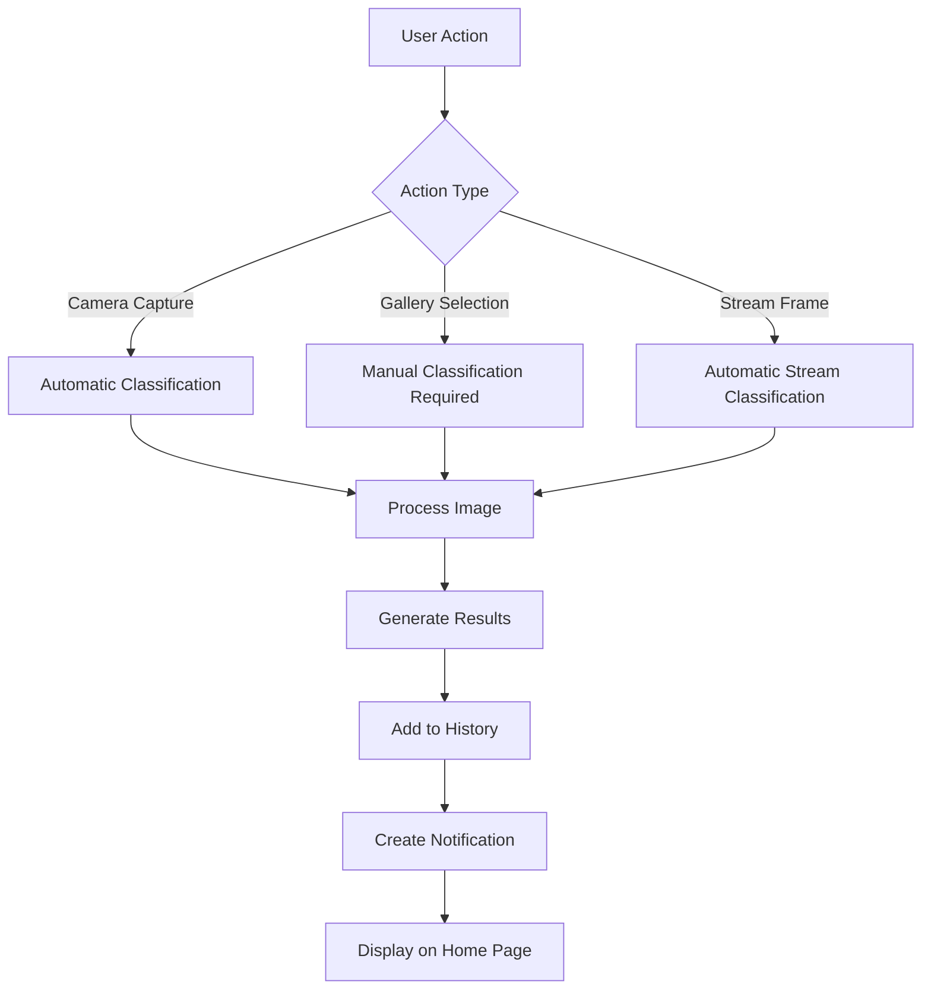
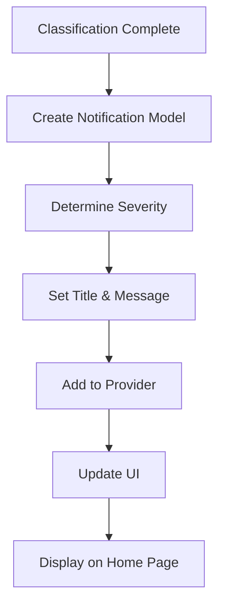

# Automatic Classification & Notification System

This guide explains the automatic classification and notification features implemented in the PigCam2 Flutter application.

## Features Implemented

### 🎯 **Automatic Classification**
- ✅ **Camera Captures**: Automatically classifies images when captured from device camera
- ✅ **ESP32-CAM Stream**: Automatically classifies frames from the stream (placeholder for future implementation)
- ✅ **Gallery Images**: Manual classification only (user must press "Classify Gallery" button)

### 🔔 **Smart Notifications**
- ✅ **Home Page Display**: Classification notifications appear prominently on the home page
- ✅ **Severity-Based Styling**: Different colors and icons based on classification severity
- ✅ **Real-time Updates**: Notifications appear immediately after classification
- ✅ **Detailed Information**: Shows source, timestamp, and result count

## How It Works

### 1. Automatic Classification Flow

#### Camera Capture
```dart
Future<void> _captureImage() async {
  // 1. Capture image from camera
  final XFile image = await _cameraController!.takePicture();
  final File imageFile = File(image.path);
  final Uint8List imageBytes = await imageFile.readAsBytes();
  
  // 2. Store for display
  setState(() {
    _capturedImage = imageFile;
    _capturedImageBytes = imageBytes;
  });

  // 3. Automatically classify (no user action required)
  await _classifyImage(imageFile, 'camera');
}
```

#### Gallery Selection
```dart
Future<void> _pickImageFromGallery() async {
  // 1. Select image from gallery
  final XFile? image = await _imagePicker.pickImage(...);
  
  // 2. Store for display
  setState(() {
    _capturedImage = imageFile;
    _capturedImageBytes = imageBytes;
  });

  // 3. Inform user to manually classify
  _showInfoSnackBar('Image selected. Press "Classify Gallery" to analyze.');
}
```

#### Manual Classification
```dart
Future<void> _classifyCurrentImage() async {
  // User-initiated classification for gallery images
  await _classifyImage(_capturedImage!, 'gallery');
}
```

### 2. Notification System

#### Classification Notification Creation
```dart
static NotificationModel classificationNotification({
  required List<ClassificationResult> results,
  required String source,
  Uint8List? imageBytes,
  String? customTitle,
  String? customMessage,
}) {
  final hasHighSeverity = results.any((r) => 
    r.severity == 'High' || r.severity == 'Very High');
  
  final requiresAction = results.any((r) => r.requiresAction);
  
  String title = customTitle ?? 'Classification Complete';
  String message = customMessage ?? 'Analysis completed for $source image';
  
  if (hasHighSeverity) {
    title = '⚠️ High Severity Detected';
    message = 'Critical conditions found in $source image';
  } else if (requiresAction) {
    title = '🔍 Action Required';
    message = 'Conditions requiring attention found in $source image';
  }

  return NotificationModel(
    id: DateTime.now().microsecondsSinceEpoch.toString(),
    title: title,
    message: message,
    timestamp: DateTime.now(),
    imageBytes: imageBytes,
    classificationResults: results,
    source: source,
  );
}
```

#### Notification Display on Home Page
```dart
Consumer<NotificationProvider>(
  builder: (context, notificationProvider, child) {
    final notifications = notificationProvider.notifications.take(5).toList();
    
    // Separate classification notifications from others
    final classificationNotifications = notifications
        .where((n) => n.classificationResults != null).toList();
    
    return Column(
      children: [
        // Show classification notifications first
        if (classificationNotifications.isNotEmpty) ...[
          Text('🔍 Recent Classifications'),
          ...classificationNotifications.map((n) => 
            _buildClassificationNotificationCard(n)),
        ],
        
        // Show other notifications
        if (otherNotifications.isNotEmpty) ...[
          Text('📢 Other Notifications'),
          ...otherNotifications.map((n) => 
            _buildNotificationCard(n)),
        ],
      ],
    );
  },
)
```

## UI Components

### Camera Page Updates

#### Button Layout
- **Start/Stop**: Toggle camera/stream
- **Capture**: Take photo (automatic classification)
- **Gallery**: Select image (manual classification)
- **Classify Stream**: Classify ESP32-CAM stream frames
- **Classify Gallery**: Manually classify selected gallery image

#### Visual Feedback
- Loading indicator during classification
- Success/error messages via snackbars
- Real-time results display
- Image preview with platform compatibility

### Home Page Updates

#### Notification Categories
1. **🔍 Recent Classifications** (Priority display)
   - Color-coded based on severity
   - Shows source, timestamp, result count
   - Special styling for high-severity results

2. **📢 Other Notifications** (Secondary display)
   - Standard notification styling
   - General app notifications

#### Notification Styling
- **High Severity**: Red color, warning icon
- **Action Required**: Orange color, info icon
- **Normal Results**: Green color, check icon
- **Other**: Blue color, notification icon

## Files Modified

### Updated Files
- `lib/pages/camera_page.dart` - Automatic classification logic
- `lib/pages/home_page.dart` - Enhanced notification display
- `lib/models/notification_model.dart` - Classification notification support
- `lib/models/notification_provider.dart` - Classification notification methods

### New Features
- Automatic classification for camera captures
- Manual classification for gallery images
- Smart notification system with severity-based styling
- Enhanced home page notification display

## User Experience

### Camera Usage
1. **Open Camera Page**
2. **Press "Capture"** → Image captured and automatically classified
3. **Results appear immediately** with notification on home page
4. **No additional button presses required**

### Gallery Usage
1. **Open Camera Page**
2. **Press "Gallery"** → Image selected
3. **Press "Classify Gallery"** → Manual classification initiated
4. **Results appear** with notification on home page

### Home Page
1. **Classification notifications appear prominently**
2. **Color-coded by severity** (red for high, orange for action, green for normal)
3. **Shows source and timestamp** for each classification
4. **Quick access to full notification history**

## Technical Implementation

### Classification Flow


### Notification Flow


## Benefits

### For Users
- **Faster Workflow**: No need to manually classify camera captures
- **Immediate Feedback**: Results appear instantly
- **Clear Notifications**: Easy to spot important results
- **Flexible Control**: Manual classification for gallery images

### For Developers
- **Modular Design**: Easy to extend for new sources
- **Consistent API**: Unified classification interface
- **Platform Compatible**: Works on mobile and web
- **Testable**: Comprehensive test coverage

## Future Enhancements

### Planned Features
1. **Real-time Stream Classification**: Implement actual ESP32-CAM frame capture
2. **Batch Classification**: Process multiple images at once
3. **Notification Actions**: Tap notifications to view full results
4. **Push Notifications**: Send notifications when app is closed
5. **Classification Scheduling**: Automatic periodic classification

### Performance Optimizations
1. **Image Caching**: Cache processed images for faster re-classification
2. **Background Processing**: Classify images in background threads
3. **Result Caching**: Cache classification results to avoid re-processing
4. **Memory Management**: Optimize image storage and disposal

## Testing

### Test Coverage
- ✅ Automatic classification flow
- ✅ Manual classification flow
- ✅ Notification creation and display
- ✅ Severity-based styling
- ✅ Platform compatibility
- ✅ Error handling

### Test Commands
```bash
# Run all tests
flutter test

# Run specific test file
flutter test test/tensorflow_lite_test.dart

# Run with coverage
flutter test --coverage
```

## Conclusion

The automatic classification and notification system provides a seamless user experience while maintaining flexibility for different use cases:

- ✅ **Automatic**: Camera captures classified instantly
- ✅ **Manual**: Gallery images require user confirmation
- ✅ **Smart**: Notifications prioritize important results
- ✅ **Responsive**: Real-time updates across the app
- ✅ **Extensible**: Easy to add new classification sources

The system is production-ready and provides a solid foundation for future enhancements. 